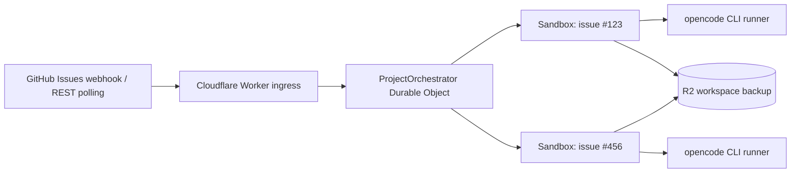

# Symphony on Cloudflare Workers + Sandboxes

`symphony-workers` は、Cloudflare Workers、Durable Objects、Cloudflare Sandboxes 上で [Symphony](https://github.com/openai/symphony) 風の GitHub Issues orchestrator を動かすための runtime package と deployment template です。GitHub Issues を tracker として、ラベルが付いた Issue を Cloudflare Sandbox 内の opencode に実行させます。

1 つの環境を設定するために、この repository を fork して直接編集する必要はありません。利用者側の project は `templates/cloudflare-worker` から始め、独自の `WORKFLOW.md` と `wrangler.jsonc` を持ち、更新時は `symphony-workers` package version と base image tag を上げる形にします。



## 配布モデル

この repository は 3 つの面を持ちます。

- `symphony-workers`: `createWorker`、`Sandbox`、`ProjectOrchestrator` を提供する npm package
- `templates/cloudflare-worker`: 利用者が自分の repository にコピーする薄い app template
- `Dockerfile`: maintainer が base image を作るための source

利用者 app が所有するものは次です。

- `WORKFLOW.md`
- `wrangler.jsonc`
- `Dockerfile`
- secrets と local `.dev.vars`
- R2 bucket 名、Worker 名

通常の runtime 更新は package と base image tag の version bump で済ませます。ただし Durable Object class 名、bindings、migrations、runner protocol が変わる release では template 側の変更も必要です。

## Features

- ラベル、担当者、優先度、Issue dependency で実行対象を絞り込みます。
- Issue ごとに Cloudflare Sandbox を起動し、opencode をバックグラウンドプロセスとして実行します。
- `/workspace` を R2 にバックアップし、再試行時に復元します。
- `/status`、`/tick`、`/jobs/:issueNumber/logs`、`/jobs/:issueNumber/retry`、`/jobs/:issueNumber/cancel` を提供します。

## アーキテクチャ

- `POST /webhooks/github` で GitHub Webhook を受信します。
- 生のリクエスト本文と `X-Hub-Signature-256` を使って HMAC-SHA256 署名を検証します。
- `issues`、`issue_comment`、`issue_dependencies` の Webhook で調停処理を起動します。
- 実行中または待機中の job は Durable Object Alarm で継続確認します。
- GitHub REST API の Issue エンドポイントに混在する Pull Request は除外します。
- Issue 番号から Cloudflare Sandbox ID を導出します。
- Durable Object が claim 状態、同時実行数、再試行、後続ターン、ブロック状態を管理します。

## 実行フロー

1. GitHub の `issues`、`issue_comment`、または `issue_dependencies` Webhook が Worker に届きます。
2. Worker が署名、delivery ID、repository 名、event、action を検証します。
3. Durable Object が GitHub REST API から最新の Issue 状態を取得します。
4. 必須ラベル、除外ラベル、担当者、ブロッカー、優先度、Issue context の変更を評価します。
5. 同時実行枠があれば、Issue を Durable Object storage で claim します。
6. Issue comment を取得し、Sandbox を起動し、repository を clone して opencode を実行します。
7. runner が JSONL 形式の event log と result file を `/workspace/.symphony` にアトミックに書き込みます。
8. 成功時は workspace を R2 に保存し、処理済みの Issue context fingerprint を記録します。
9. 失敗時は workspace を保存して Sandbox を破棄し、指数バックオフ後に復元して再試行します。
10. Issue body または actionable comment が変わり、Issue が引き続き routable な場合は次のターンを queue します。
11. Issue が closed、必須ラベルが外れた、除外ラベルが付いた、または Issue が削除された場合は job を終了します。

## 後続ターン

ターンが成功すると、job は現在の Issue body と actionable comment を処理済みとして idle になります。Issue context が変わり、Issue が引き続き実行条件を満たす場合だけ、次のターンが実行されます。標準構成では agent が GitHub Issue を自動で close しないため、作業完了時の運用を次のいずれかで決めてください。

- 人または別の automation が Issue を close する。
- `codex` ラベルを外す。
- `do-not-run` などの除外ラベルを付ける。
- GitHub write 権限と workflow policy を与えて、agent または hook が Issue を更新する。
- `agent.max_turns` を小さくして、上限到達後に operator が確認する。

Idle job は GitHub Webhook または手動 `/tick` で再評価され、定期 polling では再評価されません。

`tracker.agent_logins` に含まれる login からの comment と Issue body edit は wake signal として無視されます。`[bot]` で終わる GitHub bot account も、自己起動ループを避けるために無視されます。

## App セットアップ

### 1. Template から始める

```bash
cp -R templates/cloudflare-worker my-symphony-worker
cd my-symphony-worker
bun install
```

template app は runtime package を import し、自分の `WORKFLOW.md` を注入します。

```ts
import workflowText from "../WORKFLOW.md";
import { createWorker } from "symphony-workers";

export { ContainerProxy, ProjectOrchestrator, Sandbox } from "symphony-workers";

export default createWorker({ workflowText });
```

### 2. Base image を設定する

template には、利用する `symphony-workers` version に対応した公開 base image を `FROM` に持つ Dockerfile が含まれます。

```Dockerfile
FROM ghcr.io/kiyo-e/symphony-workers-base:0.2.0
```

`wrangler.jsonc` はこの file を指します。

```jsonc
"image": "./Dockerfile"
```

Cloudflare に deploy される container image は、利用者 app の Dockerfile から build されます。標準の Dockerfile は公開 base image を継承するだけで、project 固有の package や binary が必要な場合はこの Dockerfile に追記します。`symphony-workers` repository を fork する必要はありません。

template から deploy する場合は、Wrangler が利用者 app の Dockerfile を build して container image を upload するため、Docker または Docker-compatible CLI が必要です。

### 3. `WORKFLOW.md` を編集する

最低限、次の値は変更してください。placeholder が残っている場合、Worker は起動時に設定エラーを返します。

```yaml
tracker:
  owner: YOUR_ORG_OR_USER
  repo: YOUR_REPOSITORY

repository:
  default_branch: main
```

`repository.clone_url` を省略すると、次の URL が自動的に使われます。

```text
https://github.com/<tracker.owner>/<tracker.repo>.git
```

### 4. Binding types を生成する

```bash
bun run cf-typegen
bun run typecheck
```

### 5. R2 bucket を作成する

```bash
bunx wrangler r2 bucket create symphony-workspaces
```

bucket 名を変更する場合は、`wrangler.jsonc` の `r2_buckets[].bucket_name` と `BACKUP_BUCKET_NAME` を同じ値へ変更します。

### 6. Secrets を登録する

```bash
bunx wrangler secret put GITHUB_WEBHOOK_SECRET
bunx wrangler secret put CLOUDFLARE_ACCOUNT_ID
bunx wrangler secret put CLOUDFLARE_API_TOKEN
```

opencode は `cloudflare-workers-ai` provider として起動し、既定では Cloudflare Workers AI の `@cf/zai-org/glm-5.2` を使います。

private repository または認証済み GitHub API を使う場合は、次も登録します。

```bash
bunx wrangler secret put GITHUB_TOKEN
```

対象 repository の次の read-only 権限だけを持つ fine-grained token を推奨します。

- Metadata: Read
- Contents: Read
- Issues: Read

agent に push、Pull Request 作成、Issue 更新を許可する場合は、それぞれに必要な write 権限を意図的に追加してください。Sandbox の GitHub 通信には Worker がこの token を注入するため、token の権限がそのまま agent の最大権限になります。

### 7. デプロイする

```bash
bun run deploy
```

## Webhook の登録

Repository の **Settings -> Webhooks -> Add webhook** で、次の内容を設定します。

```text
Payload URL: https://YOUR-WORKER.YOUR-SUBDOMAIN.workers.dev/webhooks/github
Content type: application/json
Secret: GITHUB_WEBHOOK_SECRET と同じ値
SSL verification: Enable SSL verification
```

購読イベントは、最低限、次を選びます。

- Issues
- Issue comments
- Issue dependencies（`use_issue_dependencies: true` の場合）

`Ping` は疎通確認として処理されます。Issue comment は orchestrator を wake しますが、Durable Object は filtered issue context fingerprint が変わった場合だけ次のターンを開始します。

Worker は Webhook を検証した後に `202 Accepted` を返し、Durable Object の処理を `waitUntil()` で継続します。未知の event または対象外の action は無視します。

## 管理 API

```bash
# `:issueNumber` には GitHub Issue 番号を指定します。
curl https://YOUR-WORKER/healthz
curl https://YOUR-WORKER/status
curl -X POST https://YOUR-WORKER/tick
curl https://YOUR-WORKER/jobs/123/logs
curl -X POST https://YOUR-WORKER/jobs/123/retry
curl -X POST https://YOUR-WORKER/jobs/123/cancel
```

これらの endpoint は package 内では認証していません。Worker を公開する場合は route、domain、または Cloudflare Access layer で access を制限してください。

## Runtime 開発

この repository 自体を開発する場合:

```bash
bun install
bun run workflow:init
bun run cf-typegen
bun run typecheck
bun run build
```

この repository の `WORKFLOW.md` は local deployment config なので git ignore されています。template 側の `WORKFLOW.md` は利用者 app が所有する tracked file です。

root の `Dockerfile` は `cloudflare/sandbox` の上に project base image を作るためのものです。`@cloudflare/sandbox` の package version と upstream base image tag はそろえてください。この release では両方を `0.12.1` に固定しています。

対応する base image は次です。

```text
ghcr.io/kiyo-e/symphony-workers-base:<version>
```

## セキュリティ

- GitHub Webhook の secret と GitHub API token は別の値にしてください。
- Webhook secret は raw body に対する `X-Hub-Signature-256` の検証だけに使います。
- `X-GitHub-Delivery` は最近の 100 件を保存し、同じ配信 ID の再処理を防ぎます。Webhook の取りこぼしがあっても、次の Webhook、`/tick`、または Durable Object Alarm の照合が走った時点で最新状態に収束します。
- Sandbox からの outbound 通信は通常どおり有効です。ただし、Cloudflare API と GitHub API への認証ヘッダーは Worker の outbound proxy が注入します。
- opencode には `CLOUDFLARE_API_KEY=proxy-injected` だけを渡します。実 token は Worker の outbound proxy が `api.cloudflare.com` 宛ての通信へ注入するため、Sandbox 内や repository には残りません。
- npm、PyPI、Maven などを hooks または agent が利用する場合は、`Sandbox.allowedHosts` に必要な registry host だけを追加してください。
- `WORKFLOW.md` の hooks は信頼済みのデプロイ設定です。Issue 本文から shell command を生成しないでください。
- prompt は shell 経由ではなく、opencode の positional message として直接渡します。
- opencode は `--dangerously-skip-permissions` で起動します。隔離境界は外側の Cloudflare Sandbox が提供します。
- `GITHUB_TOKEN` に write 権限を与えると、Sandbox 内の agent もその権限を GitHub egress 経由で利用できます。最小権限を維持してください。

## 検証コマンド

```bash
bun run cf-typegen
bun run typecheck
bun run build
bun audit --audit-level=moderate
bunx wrangler deploy --dry-run --containers-rollout=none
```
