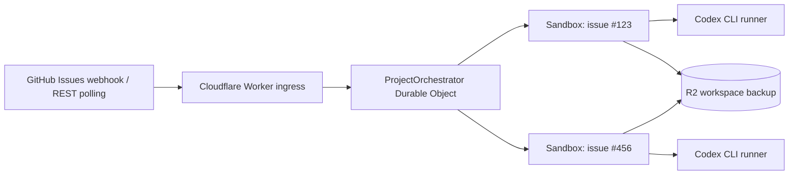

# Symphony on Cloudflare Workers + Sandboxes — GitHub Issues 版

`openai/symphony` の中心的な調停モデルを、GitHub Issues、Cloudflare Workers、Durable Objects、Cloudflare Sandboxes で構成したデプロイ可能な MVP です。



## 実装内容

- `POST /webhooks/github` で GitHub Webhook を受信します。
- 生のリクエスト本文と `X-Hub-Signature-256` を使って HMAC-SHA256 署名を検証します。
- `X-GitHub-Delivery` を Durable Object に保存して、同じ配信の重複処理を防ぎます。
- `issues` と `issue_dependencies` の Webhook で調停処理を起動します。
- Webhook を起点に調停処理を起動し、実行中または待機中の job は Durable Object Alarm で継続確認します。
- `codex` などの必須ラベル、除外ラベル、担当者、優先度ラベル、`blocked` ラベル、GitHub Issue dependency を使って実行対象を選びます。
- GitHub REST API の Issue エンドポイントに混在する Pull Request は除外します。
- Issue ごとに決定的な Cloudflare Sandbox ID を割り当てます。
- Durable Object が claim、同時実行数、再試行、継続ターン、ブロック状態を所有します。
- Codex は Sandbox 内のバックグラウンドプロセスとして実行します。
- `/workspace` と `CODEX_HOME` を R2 にバックアップし、再試行時に復元します。
- Cloudflare API token、AI Gateway ID、GitHub トークンは Worker 側に保持し、必要な外向き通信でのみ認証ヘッダーを注入します。
- `/status`、`/tick`、`/jobs/:issueNumber/retry`、`/jobs/:issueNumber/cancel` を提供します。

## 元の Symphony との差

この実装は Elixir 版の一行単位の移植ではなく、Cloudflare の実行モデルに合わせた MVP です。

- Linear の代わりに、単一 GitHub repository の GitHub Issues を tracker として使います。
- Codex App Server の常駐 JSON-RPC 接続ではなく、`codex exec --json` と `codex exec resume` を使います。
- Phoenix LiveView の代わりに JSON の状態 API を提供します。
- `WORKFLOW.md` は Worker のデプロイ時に bundle へ組み込まれます。
- GitHub App の installation token の自動発行は含みません。現在は `GITHUB_TOKEN` に fine-grained PAT または別途発行した短期 token を設定します。
- Pull Request の自動作成、Issue へのコメント、Issue の自動 close は標準では行いません。

## GitHub Issue のルーティング

既定の `WORKFLOW.md` では、次の条件を満たす open Issue を実行します。

- `codex` ラベルが付いていること。
- `do-not-run` ラベルが付いていないこと。
- `blocked` ラベルが付いていないこと。
- GitHub Issue dependency が設定されている場合は、blocking Issue がすべて closed であること。

優先度は、次のラベル順で 1〜4 に変換されます。

```yaml
priority_labels:
  - priority:urgent
  - priority:high
  - priority:medium
  - priority:low
```

GitHub Issue dependency を使わない repository では、次のように無効化できます。

```yaml
use_issue_dependencies: false
```

## 前提条件

- Cloudflare Workers Containers / Sandboxes を利用できる Cloudflare アカウント
- Cloudflare Sandboxes を利用できる Workers プラン
- Workers AI と AI Gateway を利用できる Cloudflare API token
- AI Gateway ID
- GitHub repository webhook の secret
- private repository または高い REST API rate limit が必要な場合は GitHub token
- workspace backup 用の R2 bucket と R2 S3 API credentials

## 設定

### 1. `WORKFLOW.md` を編集する

最低限、次の値を変更します。

```yaml
tracker:
  owner: YOUR_ORG_OR_USER
  repo: YOUR_REPOSITORY

repository:
  default_branch: main
```

`repository.clone_url` を省略すると、次の URL が自動的に使われます。

```text
https://github.com/<tracker.owner>/<tracker.repo>.git
```

### 2. 依存関係をインストールする

```bash
bun install
bun run cf-typegen
bun run typecheck
```

### 3. R2 bucket を作成する

```bash
bunx wrangler r2 bucket create symphony-workspaces
```

bucket 名を変更する場合は、`wrangler.jsonc` の `BACKUP_BUCKET` と `BACKUP_BUCKET_NAME` を同じ値へ変更します。

### 4. Secrets を登録する

```bash
bunx wrangler secret put GITHUB_WEBHOOK_SECRET
bunx wrangler secret put CLOUDFLARE_ACCOUNT_ID
bunx wrangler secret put CLOUDFLARE_GATEWAY_ID
bunx wrangler secret put CLOUDFLARE_API_TOKEN
bunx wrangler secret put R2_ACCESS_KEY_ID
bunx wrangler secret put R2_SECRET_ACCESS_KEY
```

Codex は custom provider `cloudflare-workers-ai` として起動し、既定では Cloudflare Workers AI の `@cf/zai-org/glm-5.2` を使います。OpenAI-compatible base URL は `CLOUDFLARE_ACCOUNT_ID` から Worker 内で組み立て、AI Gateway は `cf-aig-gateway-id: CLOUDFLARE_GATEWAY_ID` ヘッダーで指定します。

private repository または認証済み GitHub API を使う場合は、次も登録します。

```bash
bunx wrangler secret put GITHUB_TOKEN
```

通常は、対象 repository の次の read-only 権限だけを持つ fine-grained token を推奨します。

- Metadata: Read
- Contents: Read
- Issues: Read

Codex に push、Pull Request 作成、Issue 更新を許可する場合は、それぞれに必要な write 権限を意図的に追加してください。Sandbox の GitHub 通信には Worker がこの token を注入するため、token の権限がそのまま agent の最大権限になります。

### 5. デプロイする

```bash
bun run deploy
```

`@cloudflare/sandbox` の package version と Docker image tag は同じ値にそろえてください。この scaffold では両方を `0.12.1` に固定しています。

## GitHub Webhook を設定する

Repository の **Settings → Webhooks → Add webhook** で、次の内容を設定します。

```text
Payload URL: https://YOUR-WORKER.YOUR-SUBDOMAIN.workers.dev/webhooks/github
Content type: application/json
Secret: GITHUB_WEBHOOK_SECRET と同じ値
SSL verification: Enable SSL verification
```

購読イベントは、最低限、次を選びます。

- Issues
- Issue dependencies（`use_issue_dependencies: true` の場合）

`Ping` は疎通確認として処理されます。`issue_comment` は標準実装では使用しないため、購読する必要はありません。

Worker は Webhook を検証した後に `202 Accepted` を返し、Durable Object の処理を `waitUntil()` で継続します。未知の event または対象外の action は安全に無視します。

## 管理 API

```bash
# Health
curl https://YOUR-WORKER/healthz

# 現在の状態
curl https://YOUR-WORKER/status

# GitHub API の即時照合
curl -X POST https://YOUR-WORKER/tick

# blocked job の再試行。GitHub Issue 番号を使います。
curl -X POST https://YOUR-WORKER/jobs/123/retry

# 実行中または待機中の job をキャンセルします。
curl -X POST https://YOUR-WORKER/jobs/123/cancel
```

## 実行の流れ

1. GitHub の `issues` または `issue_dependencies` Webhook が Worker に届きます。
2. Worker が署名、delivery ID、repository 名、event、action を検証します。
3. Durable Object が GitHub REST API から最新の Issue 状態を取得します。
4. 必須ラベル、除外ラベル、担当者、ブロッカー、優先度を評価します。
5. 同時実行枠があれば、Issue を Durable Object storage で claim します。
6. Issue 専用 Sandbox を起動し、repository を clone して Codex を実行します。
7. runner が JSONL event と atomic result file を `/workspace/.symphony` に書き込みます。
8. 成功時は workspace を R2 に保存し、Issue が open かつ routable の間は同じ Codex thread を継続します。
9. 失敗時は workspace を保存して Sandbox を破棄し、指数バックオフ後に復元して再試行します。
10. Issue が closed、必須ラベルが外れた、除外ラベルが付いた、または Issue が削除された場合は job を終了します。

## 継続ターンについて

Issue が open のままの場合は、成功した Codex turn の後にも継続ターンが実行されます。標準構成では agent が GitHub Issue を自動で close しないため、作業完了時の運用を次のいずれかで決めてください。

- 人または別の automation が Issue を close する。
- `codex` ラベルを外す。
- `do-not-run` などの除外ラベルを付ける。
- GitHub write 権限と明示的な workflow policy を与えて、agent または hook が Issue を更新する。
- `agent.max_turns` を小さくして、上限到達後に operator が確認する。

## セキュリティ上の注意

- GitHub Webhook の secret と GitHub API token は別の値にしてください。
- Webhook secret は raw body に対する `X-Hub-Signature-256` の検証だけに使います。
- `X-GitHub-Delivery` は最近の 100 件を保存し、同じ配信 ID の再処理を防ぎます。定期 polling があるため、重複を無視した後でも最新状態へ収束します。
- Sandbox の一般的な internet access は無効です。Cloudflare Workers AI と GitHub の必要な host だけを許可しています。
- Codex には `CLOUDFLARE_API_TOKEN=proxy-injected` だけを渡します。実 token と Gateway ID は Worker の outbound proxy が `api.cloudflare.com` 宛ての通信へ注入するため、Sandbox 内や repository には残りません。
- npm、PyPI、Maven などを hooks または Codex が利用する場合は、`Sandbox.allowedHosts` に必要な registry host だけを追加してください。
- `WORKFLOW.md` の hooks は信頼済みのデプロイ設定です。Issue 本文から shell command を生成しないでください。
- prompt は shell 引数へ展開せず、Codex の stdin へ渡します。
- Codex は外側の Cloudflare Sandbox を隔離境界として、内部の approval / sandbox check を bypass して起動します。
- `GITHUB_TOKEN` に write 権限を与えると、Sandbox 内の agent もその権限を GitHub egress 経由で利用できます。最小権限を維持してください。

## 検証コマンド

```bash
bun run cf-typegen
bun run typecheck
bun audit --audit-level=moderate
bunx wrangler deploy --dry-run --containers-rollout=none
```

Docker daemon が利用できる環境では、`--containers-rollout=none` を外して container image の build まで検証してください。

## 本番運用で追加を推奨するもの

GitHub App installation token の短期発行、repository ごとの Durable Object namespace、監査 log export、dead-letter handling、実行 metrics、operator dashboard、Pull Request policy、Issue comment/state mutation、実 Cloudflare account を使った統合テストを追加することを推奨します。

## 参考資料

- GitHub: Validating webhook deliveries  
  https://docs.github.com/en/webhooks/using-webhooks/validating-webhook-deliveries
- GitHub: Best practices for using webhooks  
  https://docs.github.com/en/webhooks/using-webhooks/best-practices-for-using-webhooks
- GitHub REST API: Issues  
  https://docs.github.com/en/rest/issues/issues
- GitHub REST API: Issue dependencies  
  https://docs.github.com/en/rest/issues/issue-dependencies
- Cloudflare Sandbox SDK: Codex example  
  https://github.com/cloudflare/sandbox-sdk/tree/main/examples/codex
- Cloudflare Sandbox SDK: OpenCode AI Gateway example  
  https://github.com/cloudflare/sandbox-sdk/tree/main/examples/opencode
- Cloudflare Workers AI: GLM-5.2  
  https://developers.cloudflare.com/workers-ai/models/glm-5.2/
- Cloudflare AI Gateway: Workers AI provider  
  https://developers.cloudflare.com/ai-gateway/usage/providers/workersai/
