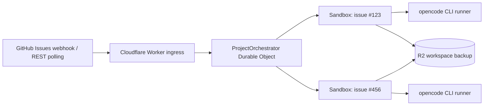

# Symphony on Cloudflare Workers + Sandboxes

[Japanese README](README.ja.md)

`symphony-workers` is a runtime package and deployment template for running a [Symphony](https://github.com/openai/symphony)-style GitHub Issues orchestrator on Cloudflare Workers, Durable Objects, and Cloudflare Sandboxes. It uses GitHub Issues as the tracker and runs labeled issues with opencode inside isolated Cloudflare Sandboxes.

Do not fork this repository just to configure one deployment. User projects should start from `templates/cloudflare-worker`, keep their own `WORKFLOW.md` and `wrangler.jsonc`, and update by bumping the `symphony-workers` package version plus the base image tag.



## Distribution Model

This repository has three deployable surfaces:

- `symphony-workers`: the npm package that provides `createWorker`, `Sandbox`, and `ProjectOrchestrator`.
- `templates/cloudflare-worker`: the thin app template users copy into their own repository.
- `Dockerfile`: the maintainer-owned base image source.

The user app owns environment-specific files:

- `WORKFLOW.md`
- `wrangler.jsonc`
- `Dockerfile`
- secrets and local `.dev.vars`
- R2 bucket names and Worker names

Most runtime updates should be package and base image version bumps. Template changes are still required if a release changes Durable Object class names, bindings, migrations, or the runner protocol.

## Features

- Filters runnable issues by labels, assignees, priority, and issue dependencies.
- Starts a Cloudflare Sandbox for each issue and runs opencode as a background process.
- Backs up `/workspace` to R2 and restores it for retries.
- Provides `/status`, `/tick`, `/jobs/:issueNumber/logs`, `/jobs/:issueNumber/retry`, and `/jobs/:issueNumber/cancel`.

## Architecture

- Receives GitHub webhooks at `POST /webhooks/github`.
- Verifies the raw request body with the `X-Hub-Signature-256` HMAC-SHA256 signature.
- Starts orchestration from `issues`, `issue_comment`, and `issue_dependencies` webhooks.
- Uses Durable Object Alarms to continue checking running or queued jobs.
- Excludes Pull Requests returned by the GitHub REST Issues endpoint.
- Derives the Cloudflare Sandbox ID from the issue number.
- The Durable Object manages claim state, concurrency, retries, follow-up turns, and blocked state.

## Execution Flow

1. A GitHub `issues`, `issue_comment`, or `issue_dependencies` webhook reaches the Worker.
2. The Worker validates the signature, delivery ID, repository name, event, and action.
3. The Durable Object fetches the latest issue state from the GitHub REST API.
4. It evaluates required labels, excluded labels, assignees, blockers, priority, and issue context changes.
5. If a concurrency slot is available, it claims the issue in Durable Object storage.
6. It fetches issue comments, starts a Sandbox, clones the repository, and runs opencode.
7. The runner atomically writes a JSONL event log and result file to `/workspace/.symphony`.
8. On success, it saves the workspace to R2 and records the processed issue context fingerprint.
9. On failure, it saves the workspace, destroys the Sandbox, restores the workspace after exponential backoff, and retries.
10. If the issue body or actionable comments change while the issue remains routable, the next turn is queued.
11. If the issue is closed, loses the required label, receives an excluded label, or is deleted, the job is terminated.

## Follow-Up Turns

After a successful turn, the job becomes idle with the current issue body and actionable comments marked as processed. Another turn runs only when that issue context changes and the issue still matches the routing rules. The default configuration does not automatically close GitHub Issues, so choose one of these completion policies:

- A person or another automation closes the issue.
- Remove the `codex` label.
- Add an excluded label such as `do-not-run`.
- Grant GitHub write permissions and a workflow policy so the agent or hook can update the issue.
- Keep `agent.max_turns` low and let an operator review jobs that reach the limit.

Idle jobs are rechecked by GitHub webhooks or manual `/tick` calls, not by periodic polling.

Comments and issue-body edits from `tracker.agent_logins` are ignored as wake signals. GitHub bot accounts ending in `[bot]` are also ignored to avoid self-triggered loops.

## App Setup

### 1. Start from the template

```bash
npx symphony-workers create my-symphony-worker
cd my-symphony-worker
bun install
```

The generated `wrangler.jsonc` uses the target directory name as the Cloudflare Worker name.

The template app imports the runtime package and injects its own `WORKFLOW.md`:

```ts
import workflowText from "../WORKFLOW.md";
import { createWorker } from "symphony-workers";

export { ContainerProxy, ProjectOrchestrator, Sandbox } from "symphony-workers";

export default createWorker({ workflowText });
```

### 2. Set the base image

The template includes a Dockerfile based on the published base image. The base image tag changes only when the runner image changes.

```Dockerfile
FROM ghcr.io/kiyo-e/symphony-workers-base:0.2.3
```

`wrangler.jsonc` points at that file:

```jsonc
"image": "./Dockerfile"
```

The image deployed to Cloudflare is built from the user app's Dockerfile. The default Dockerfile only inherits from the published base image, and users can add project-specific packages or binaries there without forking this repository.

Deploying from the template requires Docker or a Docker-compatible CLI because Wrangler builds the user app's Dockerfile before uploading the container image.

### 3. Edit `WORKFLOW.md`

At minimum, change these values. If placeholders remain, the Worker returns a configuration error at startup.

```yaml
tracker:
  owner: YOUR_ORG_OR_USER
  repo: YOUR_REPOSITORY

repository:
  default_branch: main
```

If `repository.clone_url` is omitted, this URL is used automatically:

```text
https://github.com/<tracker.owner>/<tracker.repo>.git
```

### 4. Generate binding types

```bash
bun run cf-typegen
bun run typecheck
```

### 5. Create an R2 bucket

```bash
bunx wrangler r2 bucket create symphony-workspaces
```

If you change the bucket name, update `r2_buckets[].bucket_name` in `wrangler.jsonc` and `BACKUP_BUCKET_NAME` to the same value.

### 6. Register secrets

```bash
bunx wrangler secret put GITHUB_WEBHOOK_SECRET
bunx wrangler secret put CLOUDFLARE_ACCOUNT_ID
bunx wrangler secret put CLOUDFLARE_API_TOKEN
```

opencode runs with the `cloudflare-workers-ai` provider and uses Cloudflare Workers AI `@cf/zai-org/glm-5.2` by default.

For private repositories or authenticated GitHub API access, also register:

```bash
bunx wrangler secret put GITHUB_TOKEN
```

Use a fine-grained token with only these read-only permissions for the target repository:

- Metadata: Read
- Contents: Read
- Issues: Read

To pass a secret through to hooks or agent commands, register it with the `SANDBOX_ENV_` prefix. The prefix is removed inside the Sandbox:

```bash
bunx wrangler secret put SANDBOX_ENV_RAILS_MASTER_KEY
```

If the agent needs to push, create Pull Requests, or update issues, explicitly add the required write permissions. The Worker injects this token into GitHub traffic from the Sandbox, so the token's scope is the upper bound of what the agent can do.

### 7. Deploy

```bash
bun run deploy
```

## Webhook Registration

In the repository, open **Settings -> Webhooks -> Add webhook** and configure:

```text
Payload URL: https://YOUR-WORKER.YOUR-SUBDOMAIN.workers.dev/webhooks/github
Content type: application/json
Secret: Same value as GITHUB_WEBHOOK_SECRET
SSL verification: Enable SSL verification
```

Select at least these events:

- Issues
- Issue comments
- Issue dependencies, if `use_issue_dependencies: true`

`Ping` is handled as a connectivity check. Issue comments wake the orchestrator, but the Durable Object only starts another turn when the filtered issue context fingerprint changed.

After verifying the webhook, the Worker returns `202 Accepted` and continues Durable Object work with `waitUntil()`. Unknown events and out-of-scope actions are ignored.

## Management API

```bash
# Use the GitHub Issue number for `:issueNumber`.
curl https://YOUR-WORKER/healthz
curl https://YOUR-WORKER/status
curl -X POST https://YOUR-WORKER/tick
curl https://YOUR-WORKER/jobs/123/logs
curl -X POST https://YOUR-WORKER/jobs/123/retry
curl -X POST https://YOUR-WORKER/jobs/123/cancel
```

These endpoints are not authenticated by this package. Restrict access at the route, domain, or Cloudflare Access layer if the Worker is exposed publicly.

## Runtime Development

For work on this repository:

```bash
bun install
bun run workflow:init
bun run cf-typegen
bun run typecheck
bun run build
```

`WORKFLOW.md` is ignored in this repository because it is local deployment config. The template keeps `WORKFLOW.md` tracked because each user app owns that file.

The root `Dockerfile` builds the project base image on top of `cloudflare/sandbox`. Keep the `@cloudflare/sandbox` package version and the upstream base image tag in sync; this release pins both to `0.12.1`.

The matching base image is:

```text
ghcr.io/kiyo-e/symphony-workers-base:<version>
```

## Security

- Use different values for the GitHub webhook secret and GitHub API token.
- The webhook secret is only used to verify `X-Hub-Signature-256` against the raw body.
- The latest 100 `X-GitHub-Delivery` values are stored to prevent reprocessing the same delivery ID. If a webhook is missed, the next webhook, `/tick`, or Durable Object Alarm converges to the latest state.
- Outbound traffic from the Sandbox is enabled normally. Authentication headers for Cloudflare API and GitHub API requests are injected by the Worker's outbound proxy.
- opencode only receives `CLOUDFLARE_API_KEY=proxy-injected`. The real token is injected by the Worker's outbound proxy for traffic to `api.cloudflare.com`, so it is not left inside the Sandbox or repository.
- Worker secrets named with `SANDBOX_ENV_` are forwarded to the Sandbox with that prefix removed. For example, `SANDBOX_ENV_RAILS_MASTER_KEY` becomes `RAILS_MASTER_KEY`. Do not put these values in `wrangler.jsonc`, `.dev.vars`, or `WORKFLOW.md`.
- If hooks or the agent use npm, PyPI, Maven, or similar registries, add only the required registry hosts to `Sandbox.allowedHosts`.
- `WORKFLOW.md` hooks are trusted deployment configuration. Do not generate shell commands from issue bodies.
- Prompts are passed directly as opencode positional messages, not through a shell.
- opencode starts with `--dangerously-skip-permissions`. The outer Cloudflare Sandbox provides the isolation boundary.
- If `GITHUB_TOKEN` has write permissions, the agent inside the Sandbox can use those permissions through GitHub egress. Keep permissions minimal.

## Verification Commands

```bash
bun run cf-typegen
bun run typecheck
bun run build
bun audit --audit-level=moderate
bunx wrangler deploy --dry-run --containers-rollout=none
```
