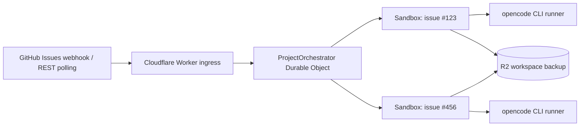

# Symphony on Cloudflare Workers + Sandboxes - GitHub Issues Edition

[Japanese README](README.ja.md)

A scaffold for running a [Symphony](https://github.com/openai/symphony)-style GitHub Issues orchestrator on Cloudflare Workers, Durable Objects, and Cloudflare Sandboxes. It uses GitHub Issues as the tracker and automatically runs labeled issues with opencode inside Cloudflare Sandboxes.

This repository is meant to be customized before deployment. Start from the included configuration, then update values such as `WORKFLOW.md`, the Worker name, the R2 bucket, and the target GitHub repository for your environment.



## Features

- Filters runnable issues by labels, assignees, priority, and issue dependencies. See [GitHub Issue routing](#github-issue-routing) for details.
- Starts a Cloudflare Sandbox for each issue and runs opencode as a background process.
- Backs up `/workspace` to R2 and restores it for retries.
- Provides `/status`, `/tick`, `/jobs/:issueNumber/retry`, and `/jobs/:issueNumber/cancel`.

## Architecture

- Receives GitHub webhooks at `POST /webhooks/github`.
- Verifies the raw request body with the `X-Hub-Signature-256` HMAC-SHA256 signature.
- Starts orchestration from `issues` and `issue_dependencies` webhooks, and uses Durable Object Alarms to continue checking running or queued jobs.
- Excludes Pull Requests returned by the GitHub REST Issues endpoint.
- Derives the Cloudflare Sandbox ID from the issue number.
- The Durable Object manages claim state, concurrency, retries, follow-up turns, and blocked state.

## Execution Flow

1. A GitHub `issues`, `issue_comment`, or `issue_dependencies` webhook reaches the Worker.
2. The Worker validates the signature, delivery ID, repository name, event, and action.
3. The Durable Object fetches the latest issue state from the GitHub REST API.
4. It evaluates required labels, excluded labels, assignees, blockers, priority, and issue context changes.
5. If a concurrency slot is available, it claims the issue in Durable Object storage.
6. It fetches issue comments, starts a Sandbox, clones the repository, and runs opencode.
7. The runner atomically writes a JSONL event log and result file to `/workspace/.symphony`.
8. On success, it saves the workspace to R2 and records the processed issue context fingerprint.
9. On failure, it saves the workspace, destroys the Sandbox, restores the workspace after exponential backoff, and retries.
10. If the issue body or actionable comments change while the issue remains routable, the next turn is queued.
11. If the issue is closed, loses the required label, receives an excluded label, or is deleted, the job is terminated.

## Follow-Up Turns

After a successful turn, the job becomes idle with the current issue body and actionable comments marked as processed. Another turn runs only when that issue context changes and the issue still matches the routing rules. The default configuration does not automatically close GitHub Issues, so choose one of these completion policies:

- A person or another automation closes the issue.
- Remove the `codex` label.
- Add an excluded label such as `do-not-run`.
- Grant GitHub write permissions and a workflow policy so the agent or hook can update the issue.
- Keep `agent.max_turns` low and let an operator review jobs that reach the limit.

Idle jobs are rechecked by GitHub webhooks or manual `/tick` calls, not by periodic polling.

Comments and issue-body edits from `tracker.agent_logins` are ignored as wake signals. GitHub bot accounts ending in `[bot]` are also ignored to avoid self-triggered loops.

## GitHub Issue Routing

The default `WORKFLOW.md` runs open issues that match these conditions:

- The issue has the `codex` label.
- The issue does not have the `do-not-run` label.
- The issue does not have the `blocked` label.
- If GitHub Issue dependencies are configured, all blocking issues are closed.

Priority is mapped to values 1 through 4 using these labels:

```yaml
priority_labels:
  - priority:urgent
  - priority:high
  - priority:medium
  - priority:low
```

Repositories that do not use GitHub Issue dependencies can disable them:

```yaml
use_issue_dependencies: false
```

## Differences from the Original Symphony

This implementation is not a faithful port of the Elixir version. It is an MVP shaped for Cloudflare's execution model.

- It uses GitHub Issues in a single GitHub repository as the tracker instead of Linear.
- It uses non-interactive `opencode run --format json`.
- It provides JSON state APIs instead of Phoenix LiveView.
- `WORKFLOW.md` is bundled when the Worker is deployed.
- It does not include automatic GitHub App installation token issuance. Set `GITHUB_TOKEN` to a fine-grained PAT or a separately issued short-lived token.
- It does not create Pull Requests, comment on issues, or close issues by default.

## Prerequisites

- A Cloudflare account and Workers plan with Cloudflare Workers Containers / Sandboxes enabled
- A Cloudflare API token that can use Workers AI
- A GitHub repository webhook secret
- A GitHub token for private repositories or higher REST API rate limits
- An R2 bucket for workspace backups

## Worker Setup

### 1. Create and edit `WORKFLOW.md`

`WORKFLOW.md` is treated as per-repository local configuration and is not committed to git. Start by copying the example:

```bash
bun run workflow:init
```

At minimum, change these values. If the `YOUR_ORG_OR_USER` or `YOUR_REPOSITORY` placeholders remain, the Worker returns a configuration error at startup.

```yaml
tracker:
  owner: YOUR_ORG_OR_USER
  repo: YOUR_REPOSITORY

repository:
  default_branch: main
```

If `repository.clone_url` is omitted, this URL is used automatically:

```text
https://github.com/<tracker.owner>/<tracker.repo>.git
```

### 2. Install dependencies

```bash
bun install
bun run cf-typegen
bun run typecheck
```

### 3. Create an R2 bucket

```bash
bunx wrangler r2 bucket create symphony-workspaces
```

If you change the bucket name, update `r2_buckets[].bucket_name` in `wrangler.jsonc` and `BACKUP_BUCKET_NAME` to the same value.

### 4. Register secrets

```bash
bunx wrangler secret put GITHUB_WEBHOOK_SECRET
bunx wrangler secret put CLOUDFLARE_ACCOUNT_ID
bunx wrangler secret put CLOUDFLARE_API_TOKEN
```

opencode runs with the `cloudflare-workers-ai` provider and uses Cloudflare Workers AI `@cf/zai-org/glm-5.2` by default.

For private repositories or authenticated GitHub API access, also register:

```bash
bunx wrangler secret put GITHUB_TOKEN
```

Use a fine-grained token with only these read-only permissions for the target repository:

- Metadata: Read
- Contents: Read
- Issues: Read

If the agent needs to push, create Pull Requests, or update issues, explicitly add the required write permissions. The Worker injects this token into GitHub traffic from the Sandbox, so the token's scope is the upper bound of what the agent can do.

### 5. Deploy

```bash
bun run deploy
```

Keep the `@cloudflare/sandbox` package version and Docker image tag in sync. This scaffold pins both to `0.12.1`.

## Webhook Registration

In the repository, open **Settings → Webhooks → Add webhook** and configure:

```text
Payload URL: https://YOUR-WORKER.YOUR-SUBDOMAIN.workers.dev/webhooks/github
Content type: application/json
Secret: Same value as GITHUB_WEBHOOK_SECRET
SSL verification: Enable SSL verification
```

Select at least these events:

- Issues
- Issue comments
- Issue dependencies, if `use_issue_dependencies: true`

`Ping` is handled as a connectivity check. Issue comments wake the orchestrator, but the Durable Object only starts another turn when the filtered issue context fingerprint changed.

After verifying the webhook, the Worker returns `202 Accepted` and continues Durable Object work with `waitUntil()`. Unknown events and out-of-scope actions are ignored.

## Management API

```bash
# Use the GitHub Issue number for `:issueNumber`.

# Health check
curl https://YOUR-WORKER/healthz

# Current state
curl https://YOUR-WORKER/status

# Reconcile with the GitHub API immediately
curl -X POST https://YOUR-WORKER/tick

# Fetch job logs and runner result
curl https://YOUR-WORKER/jobs/123/logs

# Retry a blocked job
curl -X POST https://YOUR-WORKER/jobs/123/retry

# Cancel a running or queued job
curl -X POST https://YOUR-WORKER/jobs/123/cancel
```

## Security

- Use different values for the GitHub webhook secret and GitHub API token.
- The webhook secret is only used to verify `X-Hub-Signature-256` against the raw body.
- The latest 100 `X-GitHub-Delivery` values are stored to prevent reprocessing the same delivery ID. If a webhook is missed, the next reconciliation, triggered by a webhook, `/tick`, or a Durable Object Alarm, converges to the latest state.
- Outbound traffic from the Sandbox is enabled normally. However, authentication headers for Cloudflare API and GitHub API requests are injected by the Worker's outbound proxy.
- opencode only receives `CLOUDFLARE_API_KEY=proxy-injected`. The real token is injected by the Worker's outbound proxy for traffic to `api.cloudflare.com`, so it is not left inside the Sandbox or repository.
- If hooks or the agent use npm, PyPI, Maven, or similar registries, add only the required registry hosts to `Sandbox.allowedHosts`.
- `WORKFLOW.md` hooks are trusted deployment configuration. Do not generate shell commands from issue bodies.
- Prompts are passed directly as opencode positional messages, not through a shell.
- opencode starts with `--dangerously-skip-permissions`. The outer Cloudflare Sandbox provides the isolation boundary.
- If `GITHUB_TOKEN` has write permissions, the agent inside the Sandbox can use those permissions through GitHub egress. Keep permissions minimal.

## Verification Commands

```bash
bun run cf-typegen
bun run typecheck
bun audit --audit-level=moderate
bunx wrangler deploy --dry-run --containers-rollout=none
```

If a Docker daemon is available, remove `--containers-rollout=none` to verify the container image build as well.
